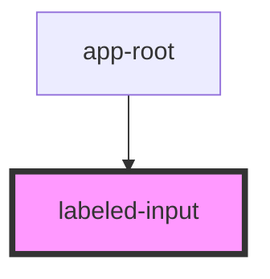

# labeled-input

<!-- Auto Generated Below -->

## Properties

| Property | Attribute | Description | Type     | Default |
| -------- | --------- | ----------- | -------- | ------- |
| `label`  | `label`   |             | `string` | `''`    |
| `name`   | `name`    |             | `string` | `''`    |

## Dependencies

### Used by

- [app-root](../app-root)

### Graph

---

_Built with [StencilJS](https://stenciljs.com/)_
