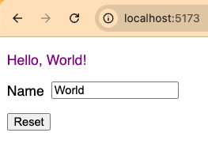

# FAST state

This is a web app that uses FAST web components.
It demonstrates using the `state` function to manage reactive state.

To run this:

1. `npm install`
1. `npm run dev`
1. Browse localhost:5173
1. Change the "Name" input and note that
   "World" in "Hello, World!" changes to the new value.
1. Click the "Reset" button and note that
   the new value reverts to "World"
   in both the "Hello" message and the `input`.

